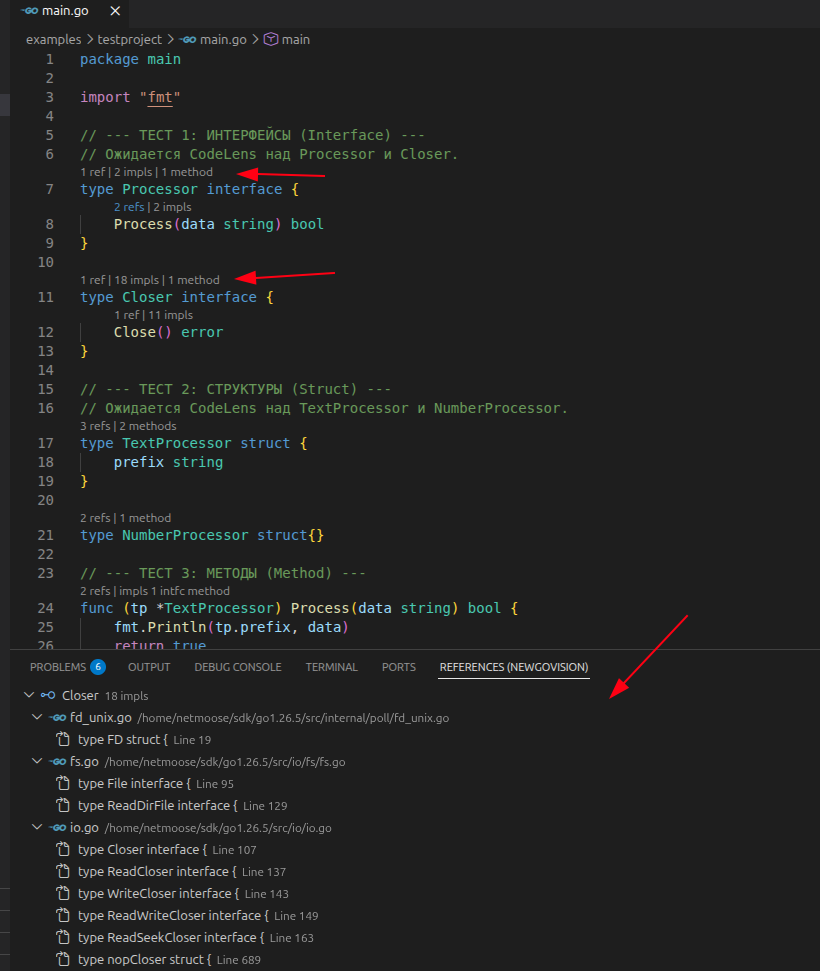

# NewGoVision

NewGoVision is a lightweight but powerful VS Code extension for Go developers that provides advanced CodeLens features. It is heavily inspired by Tooltitude and Go-Vision, aiming to provide a clean and informative developer experience.

## Features

- **Reference & Implementation Counts**: Instantly see how many times a struct, interface, method, or function is used or implemented.
- **Smart Separation**: `refs`, `impls`, and `methods` are provided as individually clickable CodeLenses, keeping information distinct and organized.
- **Methods Count**: Quickly see how many methods a struct or interface has right above its definition.
- **Custom References Tree View**: Clicking on a CodeLens with multiple locations opens a clean, hierarchical tree view in the bottom Panel (complete with VS Code icons), rather than using the default inline peek view.
- **Run & Debug**: Convenient `▶ run` and `🐞 debug` CodeLenses directly above your `main` function for quick launching.
- **Clean UI**: Automatically hides zero-counts (e.g. `0 methods`, `implements 0 intfc`) for ordinary types to prevent visual clutter.

## Requirements

- VS Code 1.80.0 or higher.
- Official [Go extension](https://marketplace.visualstudio.com/items?itemName=golang.go) (`golang.go`) must be installed and active. NewGoVision seamlessly integrates with `gopls` under the hood.

## Usage

Simply open any `.go` file in your project. The extension will automatically parse your structures and display the lenses. Click any lens to navigate directly to the symbol or view the custom References panel!

